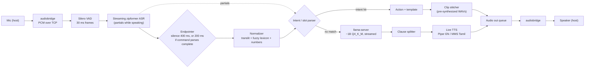

# EdgeVoice: Technical Explainer

**Audience:** HackNex 2026 judges (HNX26EPS08) and technical teammates who have not read the PRD.
**Purpose:** Explain how EdgeVoice works end to end and why we chose each major component over the alternatives.
**Status:** This is a design explainer written before the build. All numbers below are **targets** from the PRD, not measured results. Measured numbers will live in `results/` once the harness has run.

> **Relationship to the PRD.** `PRDcbt.md` is the product spec. A few decisions were confirmed with the team after it was written and **override** the PRD text:
> - The runtime is **Go**. PRD D8 ("default Python asyncio"), §14 ("Python ≥ 3.11, asyncio, ruff, pytest") and §10.3 (`scripts/run_harness.py`) are stale. The harness is the Go binary `cmd/harness`.
> - Tamil ASR follows **D1 Option B** (English streaming ASR plus normalization), not the PRD's listed default (Option A).
> - Test data is a **hybrid** of synthetic and real recordings (see §8), replacing the PRD §10.2 target of 100+ real utterances from 5+ speakers.

---

## 1. Overview

### The problem

Build a voice assistant (speech in, speech out) that runs **fully offline, CPU-only**, inside a resource limit that is **declared and visibly enforced**: **2 CPU cores and 2 GB RAM** in a Docker container on an M1 Pro MacBook. It must understand **English and Tanglish**, the Tamil–English mix people actually speak (*"naliki morning six ku alarm set pannu"* = "set an alarm for six tomorrow morning"), and reply in the same language mode the user spoke in.

Judges score latency against a baseline (25%), resource footprint (25%), quantization and offload strategy (15%), graceful degradation (15%), and research contribution shown by ablation (20%). Running on-device, with no cloud and no GPU, is a pass/fail gate.

### Two execution paths

| Path | When | Pipeline | Target E2E p50 |
|---|---|---|---|
| **Command fast path** | The intent parser recognizes a command (alarm, timer, reminder, time, date, calc, stop, greeting, identity, offline-unsupported) | ASR → normalizer → rule-based parser → action → template → **stitch pre-recorded audio clips** | **< 0.5 s** |
| **LLM chat path** | Anything the parser does not recognize | ASR → small quantized LLM (streamed) → clause-level streaming TTS | **< 1.0 s** to first audio |

The command path uses **no LLM at all**. Judges are expected to speak short commands, so the path that matters most is also the cheapest.

### Headline targets (under 2 cores / 2 GB)

| Metric | Baseline (expected) | Target |
|---|---|---|
| E2E latency, English chat, p50 | ~2–4 s | < 1.0 s |
| E2E latency, command path (EN + Tanglish), p50 | n/a (baseline always uses the LLM) | < 0.5 s |
| E2E latency p95 | — | < 1.5 × p50 |
| Peak RSS, all container processes | — | < 2.0 GB (stretch < 1.5 GB) |
| Energy per turn | measured | lower than baseline |
| Tanglish intent accuracy, held-out real recordings | raw ASR + parser | ≥ 80% (stretch 90%) |

---

## 2. How one turn works, end to end

### Process layout

- **Host (macOS):** `audiobridge`, a small Go binary that uses miniaudio (`gen2brain/malgo`) to capture the mic and play the speaker. It streams raw 16 kHz mono int16 PCM over TCP in both directions. A bridge is needed because Docker's Linux VM on macOS cannot reach the Mac's audio devices. Its RAM use is reported **separately**.
- **Container (Linux, `--cpus=2 --memory=2g --memory-swap=2g`):**
  - `edgevoice`: one Go binary. It handles audio I/O, VAD, ASR, NLU, actions, replies, TTS, metrics and the degradation controller. Each stage is a goroutine, and stages are connected by buffered channels.
  - `llama-server`: llama.cpp's C++ HTTP server, built CPU-only. `edgevoice` starts it as a subprocess, supervises it, and binds it to `127.0.0.1` (loopback only).

Speech models (Silero VAD, the zipformer ASR, Piper/MMS TTS) run in-process through the **sherpa-onnx Go bindings** (C++ ONNX Runtime underneath, CPU execution provider only).

### Pipeline diagram



### Stage by stage

1. **Host audio bridge.** The bridge sends mic PCM to the container over TCP and plays back whatever comes from the reply stream.
2. **VAD.** Silero VAD (via sherpa-onnx) classifies each 30 ms frame as speech or silence. It is always on and gates the whole pipeline: nothing downstream runs until speech starts. The timestamp of the last voiced frame becomes `t_last_voiced`, the start of our latency clock.
3. **Streaming ASR.** The English streaming zipformer (int8) receives audio **while the user is still speaking** and emits partial transcripts. When the turn ends, finalizing costs almost nothing because the decoding is already done.
4. **Endpointer.** It decides when the user has finished. The base rule is 400 ms of silence (the baseline uses 800 ms). **Semantic early-end:** if the current partial transcript already parses as a *complete* command, with every required slot filled, the turn ends after only 200 ms of silence. Utterances are capped at 10 s.
5. **Normalizer** (pure Go, no models). It transliterates any Tamil script, lowercases, splits digits from suffixes (`6ku` → `6 ku`), maps each token to a canonical form through an exact or fuzzy lexicon lookup, and converts English and Tamil number words to digits. It also counts Tamil and English hits. Details in §4.
6. **Language mode.** If at least one Tamil lexicon hit is found, the mode is `TANGLISH`; otherwise it is `ENGLISH`. The reply uses the same mode.
7. **Intent/slot parser.** It scores keywords and roles over the canonical tokens, then runs slot regexes over the canonical string. Word order does not matter, because Tamil is SOV and English is SVO. If the top score is below threshold, or a required slot is missing and cannot be defaulted, the parser returns `nil` and the turn goes to the LLM path.
8. **Command branch:** the action runs (for example, an alarm is stored). The template for `intent × mode` is filled in, and `ClipStore.Render()` concatenates pre-synthesized fragment clips, with a 30–50 ms crossfade at each join. If any fragment is missing, the whole reply falls back to live TTS and the miss is logged.
9. **Chat branch:** the transcript is sent to `llama-server` with `stream: true` and `cache_prompt: true`. Tokens stream back over SSE into a clause splitter, which cuts on `, . ? !` or after about 8 words. The first clause goes to TTS while the LLM is still generating the rest.
10. **Audio out.** PCM chunks go into the out queue, travel back over TCP and are played by the host. The first chunk sets `t_first_audio_out`.

Every stage writes monotonic timestamps to a metrics bus: `t_speech_start, t_last_voiced, t_endpoint, t_asr_final, t_nlu_done, t_route, t_llm_first_token, t_first_clause, t_tts_first_chunk, t_first_audio_out, t_turn_done`. Each turn is logged as JSONL along with its transcript, intent, slots, mode, tier, peak RSS and CPU-seconds.

### Worked example A: Tanglish command

User says: **"naliki morning six ku alarm set pannu"**

The English ASR does not know Tamil words, so it may write them in slightly different spellings. As an **illustration** (not a measured output), suppose it returns `nalaki morning six ku alarm set panu`.

| Raw token | Lookup | Canonical | Role |
|---|---|---|---|
| `nalaki` | fuzzy: distance 1 to variant `naliki` | `naalaikku` | DAY = tomorrow (Tamil hit) |
| `morning` | exact (variant of `kaalai`) | `kaalai` | PERIOD = am |
| `six` | number word | `6` | NUM |
| `ku` | exact | `manikku` | AT (Tamil hit) |
| `alarm` | exact | `alarm` | INTENT keyword |
| `set` | exact (variant of `pannu`) | `pannu` | DO |
| `panu` | fuzzy: distance 1 to `pannu` | `pannu` | DO (Tamil hit) |

- **Canonical string:** `naalaikku kaalai 6 manikku alarm pannu pannu`
- **Mode:** `tamil_hits ≥ 1` → `TANGLISH`
- **Intent:** `alarm.set`, chosen by keyword `alarm` + role DO
- **Slots:** hour 6 + PERIOD am → `time=06:00`; DAY → `day=tomorrow`
- **Endpointing:** `alarm.set` is already complete (its required slot `time` is filled) while the user is still speaking, so the turn can end after 200 ms of silence instead of 400 ms.
- **Reply:** the screen shows romanized text (*"Seri, naalaikku kaalai 6 manikku alarm vechiten"*). The audio is the same fragments in Tamil script, with "alarm" written as அலாரம். All of them are pre-synthesized clips in a single Tamil voice. No LLM is called and no live TTS is run.

### Worked example B: English chat

User says: **"tell me a fun fact about space"**

1. The streaming ASR produces partials during speech. With speculative prefill (O5) enabled, once the partial is stable the user text is sent to `llama-server` for prefill before the endpointer fires. If the final transcript differs, that prefill is discarded.
2. The endpointer waits the standard 400 ms. The parser finds no command intent and returns `nil`, so the turn goes to the LLM.
3. The system prompt (short, "1–2 sentences, reply in the user's mode, never claim actions you didn't do") was prefilled into the KV cache at startup (O4), so only the user's tokens need prefill.
4. Tokens stream back. As soon as the first clause is complete (e.g. *"Space is completely silent,"*), Piper synthesizes it and audio starts. The rest is synthesized while the first clause plays.
5. Limits: context ≤ 1024 tokens, `max_tokens` ≤ 80, threads = container cores.

---

## 3. The latency metric and why it is the honest one

```
E2E latency = t_first_audio_out − t_last_voiced_frame
```

`t_last_voiced_frame` is **when the user actually stopped speaking** according to the VAD. It is **not** when the endpointer decided the turn was over.

Why this matters:
- Many voice pipelines start the clock at the endpoint, which hides the 400–800 ms of silence the system waits before acting. Users feel that silence, so we count it.
- It makes endpointing a fair target for optimization. O2 (shorter silence) and O3 (semantic early-end) show up in the metric, and so do their failure modes. We log **false cut-offs** (the user resumed within 600 ms of the endpoint) so we cannot win latency by cutting people off.
- The baseline is measured with the same definition, so comparisons are like for like.

Measurement note: the bus records `t_first_audio_out` when the first reply PCM is emitted on the audio-out path. Playback buffering in the host bridge comes after that point and is the same for every config.

---

## 4. The Tanglish NLU insight

**In Tanglish commands, English words carry the content and Tamil words carry the structure.**

- Content: *alarm, timer, morning, six, call, weather*. A general English ASR transcribes these well.
- Structure: *naalaikku* (tomorrow), *ku / manikku* (at), *pannu / vei* (do), *enna* (what), *niruthu* (stop). This is a **small, closed set**.

Because both vocabularies are small and closed, a hand-built lexicon with fuzzy matching can recover the Tamil structure words, even when an English ASR misspells them. For this task, rules beat a small LLM on accuracy, latency and RAM.

### How the normalizer recovers garbled words

1. **Transliteration.** Any character in the Tamil Unicode block (U+0B80–U+0BFF) is mapped to Latin with a hand-written table that covers consonants, vowel signs, pulli and aytham (e.g. வெதர் → `vedhar`). No ML model is used. Under Option B the ASR outputs Latin text, so this step mostly matters for template text and for the optional Option A upgrade.
2. **Clean-up.** Lowercase the text, strip punctuation and split digits from suffixes.
3. **Lexicon lookup, three tiers:**
   - exact match against the variant list in `lexicon.yaml`;
   - otherwise **fuzzy** match: Levenshtein distance ≤ 2 for tokens of 4+ characters, ≤ 1 for shorter tokens;
   - ties are broken with a **phonetic key**: collapse doubled letters, map `dh/th→t`, `v/w→v`, `zh/l→l`, then drop vowels after the first character.
4. **Numbers.** `six`, `aaru` → `6`, and `arai`/`half` → +30 min.
5. **Output:** tokens, canonical string, `tamil_hits`, `english_hits`.

Phonetic key examples: `naalaikku` → `nalaiku` → `nlk`, and `naliki` → `nlk`, so both get the same key. `weather` → `veater` → `vtr`, and `vedhar` → `vetar` → `vtr`, which is why a `loanwords` section in the lexicon can bring Tamil-script loanwords back to their English canonical forms.

### Why this is the research contribution

The ablation table for Tanglish (§9) adds one step at a time: raw ASR → + transliteration → + fuzzy lexicon → + ASR hotword biasing. Each row reports intent accuracy, slot exact-match, WER on English loanword tokens only, and E2E latency. That shows how much each normalization step contributes.

---

## 5. Overlap optimizations (O1–O9)

Every optimization has a config flag, so the harness can turn each one on or off.

| ID | Optimization | What it buys | Applies to |
|---|---|---|---|
| O1 | Streaming ASR | Decoding happens during speech, so finalizing at the endpoint costs almost nothing. Removes the baseline's post-speech transcription wait | Both paths |
| O2 | Tuned endpointing (800 → 400 ms) | Cuts about 400 ms of pure waiting from every turn | Both paths |
| O3 | Semantic endpointing | When a command already parses complete, the silence wait drops to 200 ms | Commands |
| O4 | Prompt KV cache | System prompt prefilled once at startup, so each turn only prefills the user tokens | Chat |
| O5 | Speculative prefill | LLM prefill starts on a stable partial transcript before the endpoint, and is discarded if the final transcript differs. Built last | Chat |
| O6 | Clause-level TTS | First audio starts after the first clause, not after the full reply | Chat |
| O7 | Command fast path | LLM skipped entirely when an intent matches. Saves LLM time and energy | Commands |
| O8 | Cached clips | Reply audio is concatenated from pre-synthesized WAVs, so TTS latency is close to zero | Commands |
| O9 | LID-triggered lazy load | Tamil model loads while the user is still speaking. **Not on the critical path under Option B**: only relevant if the Option A upgrade happens | Tamil ASR (optional) |

---

## 6. Resource enforcement, measurement and CPU-only guarantees

### Enforcement

- `docker run --cpus=2 --memory=2g --memory-swap=2g`. Setting swap equal to memory means **no swap**, so the RAM limit really is 2 GB.
- To show the limits to judges: `docker inspect` on the host, and `cat /sys/fs/cgroup/cpu.max /sys/fs/cgroup/memory.max` inside the container.
- `docker update` tightens limits on the running container for the degradation demo (§7).

### Measurement

| Resource | Source | How it is reported |
|---|---|---|
| RAM (container) | cgroup v2 `memory.current` sampled every 50 ms, plus `memory.peak` | Peak and per-turn |
| RAM (per process) | `/proc/<pid>/status` `VmRSS` / `VmHWM` for `edgevoice`, `llama-server` | Breakdown per process |
| RAM (host bridge) | `audiobridge` RSS on macOS | **Reported separately** |
| CPU | cgroup `cpu.stat` `usage_usec` per turn | CPU-seconds per turn, average cores used |
| Energy | Host `sudo powermetrics --samplers cpu_power -i 200`, watts integrated over time | **Idle baseline subtracted** (container idle for 30 s); J/turn as mean ± std over multiple runs |

All of these are read directly in Go (`internal/metrics/rss.go`, `cgroup.go`), so no extra monitoring tools run inside the container.

### CPU-only guarantees

- The runtime runs in a **Linux container**, which has no access to Metal, the Apple Neural Engine or CoreML. This is one reason we use a container at all.
- llama.cpp is built with `-DGGML_METAL=OFF` and has no GPU-routed BLAS backend.
- ONNX Runtime (under sherpa-onnx) uses **CPUExecutionProvider only**. CoreMLExecutionProvider is never added.
- The kernels use **ARM NEON SIMD**, which is a CPU instruction set, not an accelerator. The write-up states this explicitly.
- **Offline:** all models are local files, the only socket is loopback to `llama-server`, and the demo runs with Wi-Fi off. Model downloads happen only in `tools/download_models.sh`, before the event.

---

## 7. Graceful degradation (T0–T3)

At startup, the degradation controller reads the cgroup limits (`cpu.max`, `memory.max`). During operation it monitors RSS and per-turn latency, then picks a tier. To change the LLM tier, it restarts `llama-server` with a different GGUF file and context size.

| Tier | Trigger (examples) | LLM | Context | TTS | Behavior |
|---|---|---|---|---|---|
| T0 | ≥ 2 cores, ≥ 2 GB | default ~1B Q4 | 1024 | live + clips | Full system |
| T1 | < 2 GB or p95 > 1.5 s | ~0.5–0.6B Q4 (same family) | 512 | live + clips | Smaller, faster chat |
| T2 | < 1.2 GB or 1 core | ~0.5B Q4 | 256 | low-quality voice + clips | Minimal chat |
| T3 | < 800 MB | **none** | — | **clips only** | Every command intent still works. Anything else gets a cached reply: *"I can only do quick commands right now"* |

The PRD's tier table also has a Tamil ASR column (lazy load / unload after turn). Under Option B there is no separate Tamil model, so that column only applies if the Option A upgrade ships.

**Demo plan:** we declare 2 cores / 2 GB. During the demo we tighten the running container to 1.5 GB, then to 1 core / 1 GB and below, and show the live metrics view switching tiers while commands keep working.

---

## 8. Baseline and ablation methodology

### Baseline (credible, not a strawman)

The baseline runs under the **same container limits** and uses the same LLM family:
- Whisper base, **non-streaming** (transcribes after the utterance ends)
- 800 ms silence endpointing
- llama.cpp default settings, **no prompt cache**
- **Full reply generated first**, then Piper TTS of the whole reply
- No command fast path, no clips

Config: `config/baseline.yaml`.

### Test data (hybrid)

| Set | Size | Source | Used for |
|---|---|---|---|
| Synthetic | ~300 utterances | TTS-generated: Piper (English), MMS (Tamil/Tanglish) | Harness development, ablation rows, latency/footprint/energy numbers |
| Real (held out) | 20–30 utterances | Developer + 2–3 other people, recorded with a small recorder tool | Headline accuracy, never used for tuning |
| Chat prompts | ~20 | English + Tanglish open questions | LLM path latency |

Labels: `{file, speaker, mode, transcript_gold, intent_gold, slots_gold}`. **Synthetic and real results are always reported separately.**

### Harness

`cmd/harness` (Go) replays WAV files in real time, with trailing silence, through any config. It collects the metrics-bus events and outputs, per config: E2E p50/p95, peak RSS, J/turn, CPU-s/turn, WER, intent accuracy, slot exact-match and false cut-off rate. Results go to `results/<config>.csv` plus a combined markdown table.

### Ablation rows (cumulative)

1. Baseline → 2. + O1 streaming ASR → 3. + O2 tuned endpointing → 4. + O4 prompt cache → 5. + O6 clause TTS → 6. + O5 speculative prefill → 7. + O7 command fast path → 8. + O8 cached clips → 9. + O3 semantic endpointing → 10. Full system. Leave-one-out runs follow if time allows.

**Secondary studies (if time allows):** Tamil script vs romanized vs mixed input to the LLM for Tanglish chat (D13: tokens per utterance and answer quality); a quantization × model-size sweep (RAM vs quality); 1 vs 2 threads vs J/turn.

---

## 9. Why this, not that

### Summary

| # | Decision | Chosen | Main alternative(s) |
|---|---|---|---|
| 1 | Runtime language | Go | Python asyncio |
| 2 | Tamil/Tanglish ASR | English streaming ASR + normalization (Option B) | IndicConformer Tamil (A); Whisper multilingual (C) |
| 3 | Language ID | None; mode decided by the lexicon | Acoustic LID; run both ASRs |
| 4 | LLM size | ~1B instruct, Q4_K_M, chosen by benchmark | ~0.5B; ~1.7B |
| 5 | Tamil LLM | None | Sarvam-1 2B; Indic Qwen fine-tune |
| 6 | TTS engines | Piper (EN), MMS-TTS (Tamil) via sherpa-onnx | Kokoro, KittenTTS, AI4Bharat Indic-TTS |
| 7 | Tanglish reply voice (D14) | One Tamil voice, loanwords in Tamil script | Two voices split by language |
| 8 | Endpointing | Silence 400 ms + parser-complete early end | Fixed 800 ms; learned turn detector |
| 9 | Wake word | VAD always on + optional keyword spotter + push-to-talk | Mandatory wake word |
| 10 | Enforcement | Docker Desktop cgroup limits | Colima/Lima; native thread caps |
| 11 | Declared limit | 2 cores / 2 GB | 2 / 1.5 GB; 1 / 1 GB |
| 12 | Test data | ~300 synthetic + 20–30 real (held out) | All real; all synthetic |
| 13 | Commands | Rules + fuzzy lexicon | LLM function calling |
| 14 | LLM integration | `llama-server` subprocess | cgo bindings to llama.cpp |
| 15 | Command reply audio | Pre-synthesized clips | Live TTS every turn |

### 9.1 Runtime language: Go
- **Chosen:** Go for all orchestration (audio, NLU, metrics, degradation, harness). Heavy inference stays in C++ (sherpa-onnx through Go bindings; llama.cpp as `llama-server`). Python is used only for offline tooling.
- **Alternatives:** Python asyncio (the PRD's original default).
- **Reasoning:** Footprint is 25% of the score, and a Python interpreter with its libraries adds roughly 100–300 MB under a 2 GB cap. Goroutines and channels fit a streaming pipeline with cancellation (barge-in, rolling back speculative prefill). A single static binary keeps the container simple.
- **Trade-off accepted:** risk around cgo bindings. **Hour-1 gate:** if the sherpa-onnx Go libraries fail on linux/arm64, we fall back to Python with the same interfaces.

### 9.2 Tamil ASR: Option B first
- **Chosen:** English streaming zipformer + transliteration + fuzzy lexicon normalization.
- **Alternatives:** (A) IndicConformer Tamil ONNX with LID and lazy loading; (C) Whisper multilingual small.
- **Reasoning:** No extra RAM and no extra model. No risk of needing a Python sidecar. The pipeline is already streaming. English content words survive well, and Tamil structure words are a small closed set that the lexicon can recover. Option C is not streaming and is weak on Tamil at small sizes.
- **Trade-off accepted:** fails on Tamil-heavy sentences. Option A becomes an upgrade **only after hour 14**, and only if a bake-off shows B is more than 10 points worse on intent accuracy.

### 9.3 Language identification: none
- **Chosen:** no LID model. Reply mode comes from the lexicon (`tamil_hits ≥ 1` → TANGLISH).
- **Alternatives:** acoustic binary LID (~20 MB ECAPA); run both ASRs and pick the more confident one.
- **Reasoning:** With a single ASR there is nothing to route, so LID has no job. Running both ASRs would double ASR CPU on 2 cores.
- **Trade-off accepted:** we give up O9 (lazy load during speech) unless Option A ships.

### 9.4 LLM size: ~1B at Q4_K_M
- **Chosen:** a ~1B instruct model (candidates: Llama 3.2 1B, Gemma 3 1B, Qwen3 ~0.6–1.7B) at Q4_K_M. The final pick comes from a 15-minute benchmark: time to first token, tokens/s on 2 cores, and a 10-prompt sanity check.
- **Alternatives:** ~0.5B (faster, noticeably weaker); ~1.7B (better, ~1.2 GB+ and slower decode on 2 cores).
- **Reasoning:** At ~0.7–1.1 GB it balances quality and speed. Chat is the fallback path, and answers are capped at 1–2 sentences. Smaller tiers use the same model family, so behavior stays consistent when the tier drops.
- **Trade-off accepted:** weak on facts.

### 9.5 Tamil LLM: none
- **Chosen:** no dedicated Tamil LLM. Tanglish chat goes to the main LLM as **romanized canonical text** (D13), with the instruction "reply in Tanglish".
- **Alternatives:** Sarvam-1 2B (Indic tokenizer); a community Indic Qwen-1.5B fine-tune.
- **Reasoning:** Commands, the judged use case, never need an LLM. Sarvam-1 adds about 1.3 GB at Q4, which breaks the 2 GB budget, and an instruct GGUF may not exist.
- **Trade-off accepted:** Tanglish chat quality is mediocre and best-effort only. Comparing tokens per sentence remains a cheap research add-on.

### 9.6 TTS engines: Piper + MMS-TTS
- **Chosen:** sherpa-onnx `OfflineTts` running Piper (English) and Meta MMS-TTS (Tamil), both VITS models.
- **Alternatives:** Kokoro-82M (more natural, slower first chunk); KittenTTS (maturity uncertain); AI4Bharat Indic-TTS (better Tamil, heavier, more setup).
- **Reasoning:** Both are small and fast on CPU, and one engine and runtime serves both languages. Clips can later be regenerated offline with a better Tamil voice without changing the runtime.
- **Trade-off accepted:** MMS Tamil sounds robotic.

### 9.7 Tanglish reply voice (D14)
- **Chosen:** write English loanwords in Tamil script (alarm → அலாரம்) and speak the whole reply with **one Tamil voice**.
- **Alternatives:** split the reply by language and use two voices.
- **Reasoning:** One consistent voice with a natural Tanglish accent, which is how people actually say these words. Switching voices mid-sentence sounds jarring.
- **Trade-off accepted:** we need a loanword-to-Tamil-script map for template words, and English words are pronounced with a Tamil accent.

### 9.8 Endpointing
- **Chosen:** 400 ms silence, dropping to 200 ms when the partial transcript parses as a complete command (D12-A).
- **Alternatives:** fixed 800 ms (baseline); a small learned turn-detector model on partials.
- **Reasoning:** It reuses the parser, so it costs nothing extra, and it saves time exactly where most judged turns happen.
- **Trade-off accepted:** helps commands only. There is a risk of cutting off a speaker who pauses after a phrase that already parses (e.g. "six" before "thirty"). The false cut-off rate is logged so this is visible.

### 9.9 Wake word
- **Chosen:** VAD always listening + an optional sherpa-onnx open-vocabulary keyword spotter behind a flag + a push-to-talk key as an emergency fallback.
- **Alternatives:** a mandatory trained wake word.
- **Reasoning:** This meets the "wake word / VAD" requirement with no added latency and no model training. The keyword spotter needs no training.
- **Trade-off accepted:** false triggers in a noisy hall, which we mitigate with on-site VAD tuning and push-to-talk.

### 9.10 Enforcement mechanism
- **Chosen:** Docker Desktop with `--cpus --memory --memory-swap`.
- **Alternatives:** Colima/Lima VM (lighter, but changing limits needs a VM restart); native macOS with thread caps (**not enforced**).
- **Reasoning:** Judges recognize it, the limits are visible, and `docker update` changes limits **live** for the degradation demo.
- **Trade-off accepted:** Docker Desktop VM overhead, and audio needs the host bridge.

### 9.11 Declared limit
- **Chosen:** declare 2 cores / 2 GB.
- **Alternatives:** 2 / 1.5 GB; 1 / 1 GB.
- **Reasoning:** Comfortable headroom for the full stack under judging. Tighter limits are shown **live** as degradation tiers, which earns credit for both footprint and degradation.
- **Trade-off accepted:** other teams may declare smaller limits.

### 9.12 Test data
- **Chosen:** ~300 TTS-synthesized utterances + 20–30 real recordings as a held-out test set.
- **Alternatives:** 100+ real utterances from 5+ speakers (PRD §10.2); synthetic only.
- **Reasoning:** One developer has ~23 hours. Synthetic audio gives enough volume for latency, footprint and ablation runs. Real recordings keep the accuracy claim honest.
- **Trade-off accepted:** synthetic audio is clean and partly comes from the same TTS family as our replies, so it **inflates accuracy**. That is why it is reported separately.

### 9.13 Rules vs LLM for commands
- **Chosen:** keyword/role scoring + slot regexes over canonical tokens.
- **Alternatives:** LLM intent classification or function calling.
- **Reasoning:** Rules are deterministic, unit-testable, and fast (well under the 0.5 s target). They use no extra RAM, work in tier T3 with no LLM loaded, and are order-agnostic across SOV and SVO.
- **Trade-off accepted:** unseen phrasings miss. Those fall through to the LLM path, or to a polite "didn't get that".

### 9.14 `llama-server` subprocess vs cgo bindings
- **Chosen:** spawn and supervise `llama-server` on loopback. Stream with SSE and use `cache_prompt: true`.
- **Alternatives:** link llama.cpp into the Go binary through cgo.
- **Reasoning:** A crash in the LLM cannot take down the audio pipeline. Switching tiers is just a restart with a different GGUF and context size. It uses a stock upstream build with Metal off, and avoids extra cgo risk on a 24-hour clock.
- **Trade-off accepted:** a small HTTP/SSE overhead on loopback, and a second process whose RSS is counted in the container total.

### 9.15 Clips vs live TTS for command replies
- **Chosen:** `cmd/buildclips` pre-synthesizes every template fragment (numbers 1–12, minute values, day/period words, offline/error replies) for both modes **with the runtime TTS engine**. At runtime the fragments are concatenated with 30–50 ms crossfades.
- **Alternatives:** live TTS for every reply.
- **Reasoning:** Command reply audio is ready almost instantly. The voice is identical to live TTS. Clips are what keep T3 working with no live synthesis, and they earn the "cached TTS" bonus.
- **Trade-off accepted:** joins may sound slightly stitched. A missing fragment falls back to live TTS for the whole reply, and the miss is logged.

---

## 10. Risks and mitigations

| Risk | Mitigation |
|---|---|
| sherpa-onnx Go libraries fail on linux/arm64 | Hour-1 gate; fall back to a Python runtime with identical interfaces |
| Audio into the container fails or glitches | Bridge built first (hours 0–2) with a loopback test; audio stays on the host by design |
| Accidental Metal/ANE use | CPU-only builds inside a Linux container; build flags documented |
| Option B fails on Tamil-heavy phrasing | Grow the lexicon from dev recordings; LLM fallback; Option A upgrade after hour 14 if the bake-off justifies it |
| Judges use phrasing we have not seen | Varied speakers in the real set; fuzzy matching; graceful "sorry, didn't get that" |
| Noisy judging hall breaks VAD | Tune the VAD threshold on-site; push-to-talk fallback |
| Energy numbers are noisy | Idle subtraction, multiple runs, mean ± std |
| Speculative prefill adds complexity | Built last, chat path only, behind a flag |
| Time overrun (solo developer, ~23 h, sequential plan) | Hard Tanglish freeze at hour 14; harness built early so numbers exist regardless |

---

## 11. Limitations and honesty notes

- **All numbers here are targets.** Measured results will be published from `results/` with their configs.
- **Synthetic test audio inflates accuracy.** It is clean, consistently paced, and partly made with the same TTS family the system speaks with. Headline accuracy claims come only from the **real held-out recordings**, and the synthetic numbers are labeled as such.
- **The real test set is small** (20–30 utterances from 3–4 speakers), so each utterance moves accuracy by about 3–5 points. We report counts alongside percentages.
- **Tanglish chat is best-effort.** Only Tanglish **commands** are guaranteed. Free-form Tanglish conversation goes through a generic ~1B model with romanized input, and its quality will be mediocre.
- **Option B has a known ceiling.** Sentences that are mostly Tamil (few English content words) are likely to fail parsing.
- **Energy is measured at the host CPU**, so it includes Docker Desktop VM overhead. Idle subtraction removes the steady-state share, but not every effect.
- **The host audio bridge runs outside the container** and is reported separately, not hidden.
- **No real internet intents.** Weather and news requests get an honest cached "I'm offline" reply.
- **MMS Tamil voice quality is robotic.** Better clips may be regenerated offline on the same laptop before judging if time allows.
